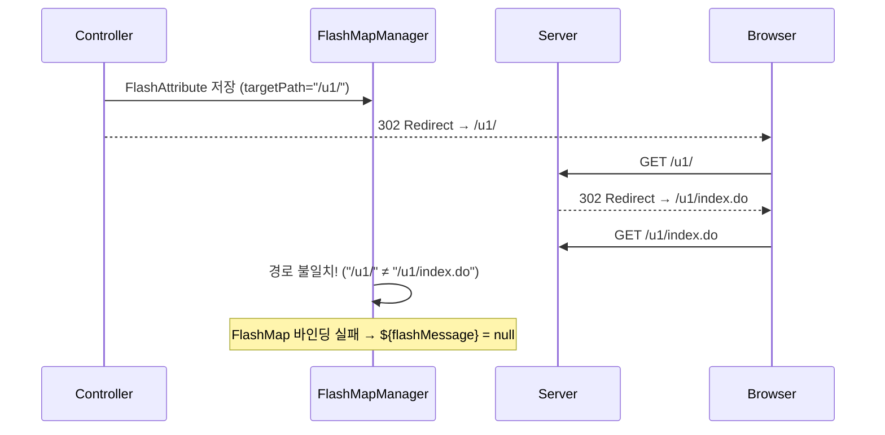

# 20260113 - FlashMessage 로그인 성공 알림 Status

## 📌 업무 개요
로그인 성공 시 FlashMessage를 바인딩하여 리다이렉트된 페이지에서 "로그인 성공" 알림을 표시

## 📐 현재 상태
- [x] 계획 수립
- [x] 사용자 승인
- [x] 실행
- [x] 검증 완료

## 📂 참조 문서
- [FlashMessage 통합 연동 레퍼런스](../../_ref/common/infrastructure/infra-util_FlashMessage_통합_연동_레퍼런스.md)

## 🎯 수정 대상 파일
| 파일 | 경로 (프로젝트 루트 기준) |
|:---|:---|
| U1LoginController.java | `client/u1/java/custom/app/web/U1LoginController.java` |

## 📝 작업 기록 (Records)

### 2026-01-13 14:47
- 작업 시작, `U1LoginController.java` 분석 완료

### 2026-01-13 14:48
- 사용자 승인 완료, `flashMessage` FlashAttribute 추가

### 2026-01-13 15:05 ~ 15:17
- **이슈 발견 및 해결** (아래 Walkthrough 참조)

---

## 📋 Walkthrough

### 🔑 핵심 이슈: 2차 리다이렉트로 인한 FlashMap 경로 불일치

Spring의 `FlashMapManager`는 FlashAttribute를 저장할 때 **targetPath**를 함께 기록하고, 리다이렉트된 요청의 경로가 이와 **정확히 일치**해야만 Model에 바인딩합니다.

**문제 상황:**
```
Controller: RedirectView("/u1/", true)  → FlashMap targetPath = "/u1/"
Server:     /u1/ 요청 시 302 → /u1/index.do 로 재리다이렉트
Browser:    /u1/index.do 에서 페이지 렌더링 (FlashMap 손실!)
```



### ✅ 해결 방법: 최종 렌더링 경로로 직접 리다이렉트

```diff
 // 이전: 2차 리다이렉트 발생
-redirectPage = "/" + siteId + "/";
+redirectPage = "/" + siteId + "/index.do";

 // 이전: 절대 URL 사용
-return new RedirectView(host + redirectPage, false);
+return new RedirectView(redirectPage, true);
```

### 최종 수정 코드

```java
// 로그인 성공 메시지 (사용자 이름 포함)
redirectAttr.addFlashAttribute("loginResult", loginResultVO);
String memberNm = loginResultVO.getLoginVO().getMemberNm();
if (StringUtil.isEmpty(memberNm)) {
    redirectAttr.addFlashAttribute("flashMessage", "로그인에 성공하였습니다.");
} else {
    redirectAttr.addFlashAttribute("flashMessage", memberNm + "님, 로그인에 성공하였습니다.");
}

// 최종 경로로 직접 리다이렉트 (2차 리다이렉트 방지)
return new RedirectView(redirectPage, true);
```

### 검증 결과
- ✅ 로그인 성공 시 "홍길동님, 로그인에 성공하였습니다." 알림 표시 확인
- ✅ 이름이 없는 경우 기본 메시지 표시 확인
