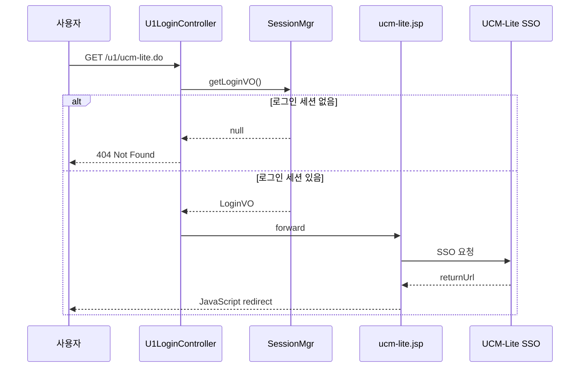

# 📋 UCM-Lite 컨트롤러 분리 작업

> **상태**: ✅ 완료  
> **시작일**: 2026-01-13  
> **완료일**: 2026-01-13  
> **작업자**: Antigravity  

---

## 📌 작업 개요

UCM-Lite SSO 연동 JSP(`ucm-lite.jsp`)를 직접 접근 방식에서 **컨트롤러 기반 접근 방식**으로 변경하고, JSP를 간소화했습니다.

### 요구사항

1. **컨트롤러 엔드포인트 생성**: `/u1/ucm-lite.do` URL 경로 추가 ✅
2. **세션 검증 로직**: 로그인 세션 없으면 404 에러 반환 ✅
3. **뷰 처리**: 기존 `ucm-lite.jsp`로 포워딩, SSO 로직은 JSP에서 처리 ✅
4. **JSP 간소화**: 불필요한 HTML 제거, 에러 로그 미출력 ✅

---

## 📂 참조 문서

- [Work_Directory.md](../_info/Work_Directory.md)

---

## 📝 Records

### 참조 문서
- [Work_Directory.md](../_info/Work_Directory.md) - 디렉토리 구조 가이드

### 수정 파일 목록
- `client/u1/java/custom/app/web/U1LoginController.java` - ucmLite() 메소드 추가
- `webapp/_custom/u1/jsp/ucm-lite.jsp` - 불필요 코드 제거 및 간소화

---

## 📊 Walkthrough

### 1. 컨트롤러 수정 (U1LoginController.java)

```diff
+   @RequestMapping(value = "/u1/ucm-lite.do")
+   public String ucmLite(HttpServletRequest request, HttpServletResponse response) throws Exception {
+       com.andwise.jw.auth.vo.LoginVO loginVO = com.andwise.jw.auth.web.SessionMgr.getLoginVO();
+       if (loginVO == null || loginVO.getMemberId() == null) {
+           response.sendError(HttpServletResponse.SC_NOT_FOUND);
+           return null;
+       }
+       return "forward:/_custom/u1/jsp/ucm-lite.jsp";
+   }
```

### 2. JSP 간소화 (ucm-lite.jsp)

**기존 (261줄)** → **수정 후 (95줄)**: 63% 축소

| 제거 항목 | 설명 |
|-----------|------|
| HTML 구조 | `<html>`, `<head>`, `<body>` 등 불필요한 태그 제거 |
| 에러 페이지 | CSS 스타일 및 에러 표시 HTML 전체 삭제 |
| 에러 로그 | `StackTrace` 출력 로직 제거 → 예외 발생 시 무시 |

**핵심 코드만 유지**:
```jsp
<script>location.href = "<%=ssoUrl%><%=returnUrl%>";</script>
```

### 동작 흐름



### 검증 방법

| 테스트 케이스 | 예상 결과 |
|---------------|-----------|
| 비로그인 상태에서 `/u1/ucm-lite.do` 접근 | 404 에러 페이지 |
| 로그인 상태에서 `/u1/ucm-lite.do` 접근 | UCM-Lite SSO 페이지로 리다이렉트 |
