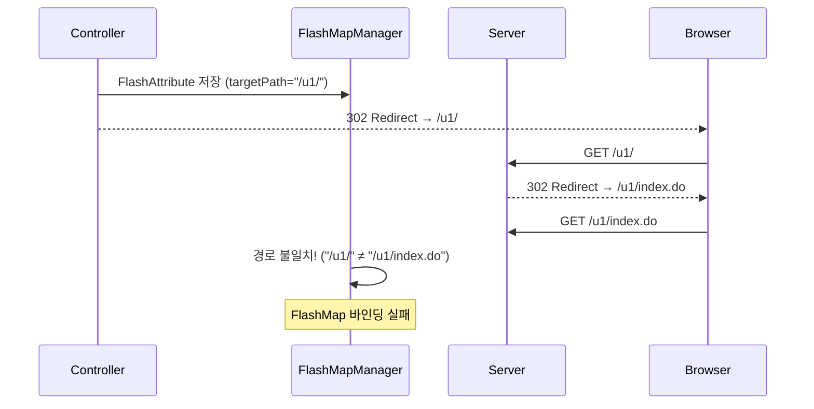

# FlashMessage 리다이렉트 바인딩 개발 라이브러리

## 1. 개요 (Context)

**문제 상황**: Spring MVC에서 `RedirectAttributes.addFlashAttribute()`로 저장한 FlashMessage가 리다이렉트 후 JSP(`${flashMessage}`)에서 바인딩되지 않는 현상

**발생 조건**:
- 컨트롤러에서 절대 URL(`http://...`)로 리다이렉트
- 또는 중간 경로(`/u1/`)로 리다이렉트 후 서버가 다시 최종 경로(`/u1/index.do`)로 302 리다이렉트

## 2. 핵심 원인 분석 (Root Cause)

Spring의 `FlashMapManager`는 FlashAttribute 저장 시 **targetPath**를 함께 기록합니다. 리다이렉트된 요청의 경로가 이 targetPath와 **정확히 일치**해야만 Model에 바인딩됩니다.

### 2차 리다이렉트 문제

```
Controller: RedirectView("/u1/", true)  → FlashMap targetPath = "/u1/"
Server:     /u1/ 요청 시 302 → /u1/index.do 로 재리다이렉트
Browser:    /u1/index.do 에서 페이지 렌더링
```

**결과**: targetPath(`/u1/`) ≠ 실제 렌더링 경로(`/u1/index.do`) → **바인딩 실패**



## 3. 해결 방안 (Solution)

### 규칙 1: 최종 렌더링 경로로 직접 리다이렉트

```diff
 // ❌ 잘못된 예: 2차 리다이렉트 발생
-redirectPage = "/" + siteId + "/";

 // ✅ 올바른 예: 최종 경로 직접 지정
+redirectPage = "/" + siteId + "/index.do";
```

### 규칙 2: 상대 경로(contextRelative) 사용

```diff
 // ❌ 잘못된 예: 절대 URL 사용
-return new RedirectView(host + redirectPage, false);

 // ✅ 올바른 예: 상대 경로 사용
+return new RedirectView(redirectPage, true);
```

### 완성 코드 패턴

```java
// FlashMessage 추가 (사용자 이름 조건부 포함)
redirectAttr.addFlashAttribute("loginResult", loginResultVO);
String memberNm = loginResultVO.getLoginVO().getMemberNm();
if (StringUtil.isEmpty(memberNm)) {
    redirectAttr.addFlashAttribute("flashMessage", "로그인에 성공하였습니다.");
} else {
    redirectAttr.addFlashAttribute("flashMessage", memberNm + "님, 로그인에 성공하였습니다.");
}

// 최종 경로로 직접 리다이렉트 (2차 리다이렉트 방지)
return new RedirectView(redirectPage, true);
```

## 4. 관련 레퍼런스 (References)

- [FlashMessage 통합 연동 레퍼런스](../_ref/common/infrastructure/infra-util_FlashMessage_통합_연동_레퍼런스.md)

## 5. 체크리스트 (Quick Check)

FlashMessage가 바인딩되지 않을 때 확인할 사항:

| # | 확인 항목 | 해결 방법 |
|:--|:---------|:---------|
| 1 | 절대 URL(`http://...`)로 리다이렉트? | `RedirectView(path, true)` 사용 |
| 2 | 중간 경로로 리다이렉트 후 서버가 재리다이렉트? | 최종 렌더링 경로로 직접 리다이렉트 |
| 3 | `page.jsp`에 `flash-map` 바인딩 코드 존재? | `${!empty flashMessage}` JSTL 확인 |
