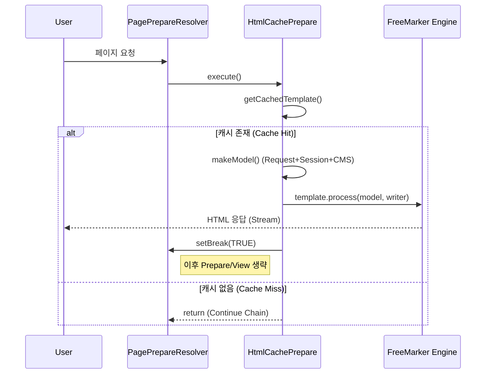

# HtmlCachePrepare 레퍼런스

## 📐 분류 정보 (Classification)

| 항목 | 값 |
|:---|:---|
| **계층 (Layer)** | Application |
| **분류 코드** | app-interceptor |
| **저장 유형** | Common |

## 종합 요약 및 노하우
`PagePrepareResolver` 체인 내에서 동작하며, 사전에 크롤링된 템플릿과 실시간 요청 모델(`makeModel`)을 결합하여 HTML을 즉시 응답하고 처리를 중단(`setBreak`)하는 고성능 **캐시 렌더링 인터셉터**입니다.

## Referenced Assets
- `src/main/java/com/andwise/jw/web/prepare/impl/HtmlCachePrepare.java`
- `src/main/webapp/_custom/unist/properties/config/spring/context-jiniworks-web-prepare.xml`

## 핵심 선언

### 1. 캐시 렌더링 아키텍처
`makeModel`로 통합된 데이터와 캐시된 템플릿을 `template.process(model, writer)`로 병합 후, `prepareVO.setBreak(true)`를 호출하여 이후 뷰 렌더링을 차단하고 응답을 종결합니다.

### 2. 응답 헤더 명세
응답 시 `Cms-Cache-Crawling` (생성일시), `Cms-Cache-LastModified` (최종수정일) 헤더를 주입하여 캐시 생명주기 및 디버깅 정보를 클라이언트에 전달합니다.

### 3. 인터셉터 체인 배치
`context-jiniworks-web-prepare.xml`의 `PagePrepareResolver` 리스트에서 **20번째** 순서로 배치되어, 보안/권한 체크(Secure, Domain) 이후이자 메인 페이지 이동(`GotoMainPage`) 이전에 실행됩니다.

## 📊 시각적 구조 (Optional)

### 캐시 렌더링 시퀀스


## Source Specifics (필요 시)
```java
// L215: 모델 생성 및 렌더링
Map<String,Object> model = makeModel( request, siteVO, pageVO );
template.process(model, writer);

// L235: 체인 중단 (핵심)
prepareVO.setView(null);
prepareVO.setBreak( Boolean.TRUE ); 
```
