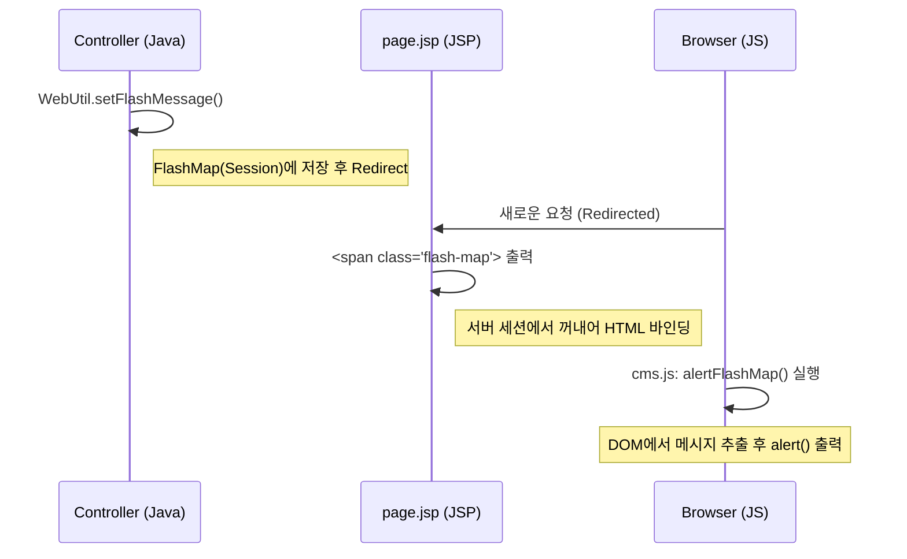

# FlashMessage 서버-클라이언트 통합 연동 레퍼런스

## 📐 분류 정보 (Classification)

| 항목 | 값 |
|:---|:---|
| **계층 (Layer)** | Infrastructure |
| **분류 코드** | `infra-util` |
| **저장 유형** | Common |

## 종합 요약 및 노하우
이 시스템은 **서버(`WebUtil`) -> 뷰(`page.jsp`) -> 클라이언트(`cms.js`)**로 이어지는 3각 연동을 통해 리다이렉트 간 메시지를 안전하게 전달하고 사용자에게 알럿(Alert)을 띄우는 자동화 구조를 가집니다.

## Referenced Assets
- `java/com/andwise/jw/util/web/WebUtil.java`
- `webapp/WEB-INF/jsp/cms-template/page.jsp`
- `webapp/_res/_common/js/cms.js`

---

## 핵심 선언

### 1. WebUtil FlashMessage 주입 패턴 (Server)
서버측 컨트롤러에서 리다이렉트 시 전달할 데이터를 세션(FlashMap)에 저장합니다.
```java
// 단일 메시지 주입
WebUtil.setFlashMessage(request, "flashMessage", "성공하였습니다.", targetPath);

// 컨트롤러 RedirectAttributes 활용 (동일 메커니즘)
redirectAttr.addFlashAttribute("flashMessage", "개인화 메시지");
```

### 2. page.jsp FlashMessage 바인딩 규격 (View)
서버에서 전달된 `flashMessage`를 HTML 영역에 `flash-map` 클래스를 가진 히든 요소로 렌더링합니다.
```jsp
<c:if test="${!empty flashMessage}">
    <c:choose>
        <c:when test="${jw:instanceOf(flashMessage,'java.lang.String')}">
            <span class="flash-map"><c:out value="${flashMessage}"/></span>
        </c:when>
        <%-- List 또는 ErrorVO 처리 로직 생략 --%>
    </c:choose>
</c:if>
```

### 3. cms.js alertFlashMap 연동 메커니즘 (Client)
페이지 로드 시 `flash-map` 클래스를 찾아 텍스트를 추출하고 Native Alert을 실행합니다.
```javascript
function alertFlashMap() {
    if( $('.flash-map').length > 0 ) {
        var msg = '';
        $('.flash-map').each(function( index ) {
            if(!$(this).data('flash-map')) { // 중복 실행 방지
                msg += $(this).text();
                $(this).data('flash-map', true);
            }
        });
        if(msg.length > 0) alert(msg);
    }
}
// DOM Ready 시 자동 호출됨
$(function() { alertFlashMap(); });
```

---

## 종합 분석

### 서버-JSP-JS 간 3각 연동 흐름


> [!IMPORTANT]
> `flash-map` 요소의 중복 알럿을 방지하기 위해 jQuery `.data('flash-map', true)` 속성을 사용하여 실행 여부를 추적합니다.
>
> **⚠️ 매칭 이슈 주의 (Node.js/Spring 공통)**:
> `WebUtil.setFlashMessage` 호출 시 `targetPath`에 **절대 URL**(http://...)을 넣으면 Spring의 내부 경로 매칭 실패로 JSTL 바인딩이 안 될 수 있습니다. 
> 특별한 필터링이 필요 없다면 **`null`**을 전달하여 모든 리다이렉트 경로에서 데이터가 유효하도록 설정할 것을 강력히 권장합니다.
