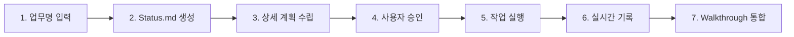
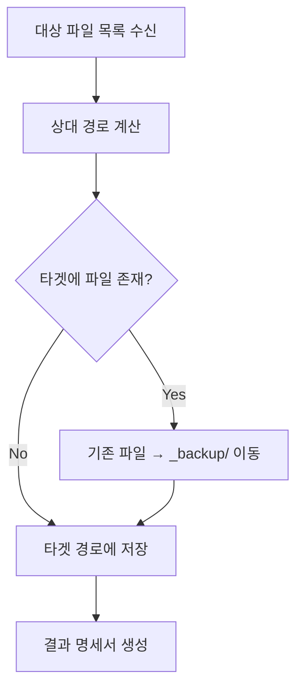
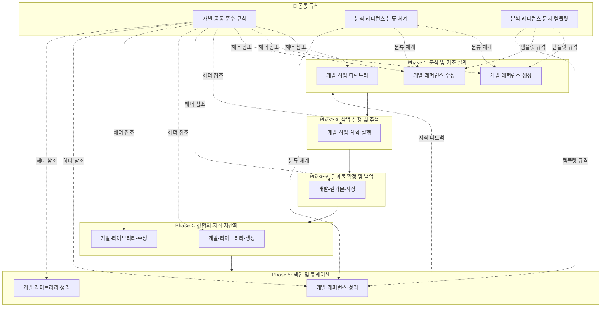

# 통합 업무 프로세스 (The One Process)

본 문서는 프로젝트의 모든 개발 작업이 따라야 하는 **5단계 유기적 라이프사이클**을 정의합니다.  
파편화된 작업 대신 **지식의 선순환 구조**를 통해 체계적인 개발과 지식 자산화를 달성합니다.

---

## 🎯 핵심 원칙 (Foundation)

모든 워크플로우는 다음 공통 규칙을 **암묵적으로 탑재**합니다:

### [개발-공통-준수-규칙](./antigravity/개발-공통-준수-규칙.md)
| 원칙 | 설명 |
|:---|:---|
| **Step 0: 절대적 초기화** | 모든 작업 전 `_develop/_info/Project_Root.md`로 프로젝트 루트 확보 |
| **상대 경로 강제** | 문서/코드에 절대 경로(로컬 PC 경로) 노출 엄격 금지 |
| **인덱스 우선 탐색** | 개별 파일 탐색 전 `_Lib_Index.md`, `_Ref_Index.md` 우선 참조 |
| **지식 탐색 우선순위** | `_lib`(실무 라이브러리) → `_ref`(기술 표준) 순으로 진실 채택 |
| **정밀 분석 표준** | 복합 소스 수집 + 의도 파악의 통합 분석 필터 적용 |

---

## Phase 1: 분석 및 기초 설계 (Design & Preparation)

작업에 들어가기 전, **대상의 구조를 파악**하고 **필요한 기준(Reference)**을 확보하는 단계입니다.

### 관련 워크플로우

| 워크플로우 | 기능 | 산출물 |
|:---|:---|:---|
| [개발-작업-디랙토리](./antigravity/개발-작업-디랙토리.md) | 프로젝트 폴더 구조와 경로별 역할을 분석하여 지식베이스로 관리 | `_develop/_info/Work_Directory.md` |
| [개발-레퍼런스-생성](./antigravity/개발-레퍼런스-생성.md) | 다양한 입력(파일/폴더/코드블록) 분석 후 기술 스펙 문서 생성 | `_develop/_ref/[common\|custom]/...` |
| [개발-레퍼런스-수정](./antigravity/개발-레퍼런스-수정.md) | 기존 레퍼런스에 신규 소스 분석 결과를 보강 | 기존 `_ref/*.md` 갱신 |

### 지원 문서 (Architecture & Template)

| 문서 | 용도 |
|:---|:---|
| [분석-레퍼런스-분류-체계](./antigravity/분석-레퍼런스-분류-체계.md) | 5계층 아키텍처(Presentation→Infrastructure) 기반 분류 코드 체계 정의 |
| [분석-레퍼런스-문서-템플릿](./antigravity/분석-레퍼런스-문서-템플릿.md) | 레퍼런스 표준 템플릿 및 `_Ref_Index.md` 테이블 포맷 |

---

## Phase 2: 작업 실행 및 추적 (Execution & Tracking)

실질적인 코드를 작성하며 **진행 상황을 실시간으로 관리**하는 단계입니다.

### 관련 워크플로우

| 워크플로우 | 기능 | 산출물 |
|:---|:---|:---|
| [개발-작업-계획-실행](./antigravity/개발-작업-계획-실행.md) | **선 계획 후 승인** 원칙 준수, Status.md 중심 작업 이력 누적 | `_develop/_ing/[날짜]_[업무명]_Status.md` |

### 핵심 실행 원칙



> [!CAUTION]
> **모든 대화/수정/요청은 반드시 기록**  
> - 사용자와의 대화 흐름 전체를 `Status.md`에 누적  
> - 코드 수정 직후 → 수정 파일 목록 즉시 갱신  
> - 후속 워크플로우 호출은 **사용자 명시적 지시** 시에만

---

## Phase 3: 결과물 확정 및 백업 (Validation & Patch)

완료된 기능을 검증하고, **재배포 가능한 형태**로 결과물을 모으는 단계입니다.

### 관련 워크플로우

| 워크플로우 | 기능 | 산출물 |
|:---|:---|:---|
| [개발-결과물-저장](./antigravity/개발-결과물-저장.md) | 수정 파일들을 폴더 구조 유지하며 패치 형태로 수집, 중복 시 안전 백업 | `_develop/_result/[업무명]/_Result_Manifest.md` |

### 동작 흐름



---

## Phase 4: 경험의 지식 자산화 (Knowledge Assetization)

단순한 코드 작성을 넘어, **해결 과정에서 얻은 노하우를 자산으로 변환**하는 단계입니다.

### 관련 워크플로우

| 워크플로우 | 기능 | 산출물 |
|:---|:---|:---|
| [개발-라이브러리-생성](./antigravity/개발-라이브러리-생성.md) | 문제 해결 경험(Context, Solution, Retrospective)을 라이브러리로 아카이빙 | `_develop/_lib/[주제]_Library.md` |
| [개발-라이브러리-수정](./antigravity/개발-라이브러리-수정.md) | 기존 라이브러리에 신규 소스 분석/통합하여 솔루션 보강 | 기존 `_lib/*.md` 갱신 |

### 라이브러리 문서 구조

```markdown
# [주제] 개발 라이브러리

## 1. 개요 (Context)
- 어떤 상황에서 발생한 문제였는가?

## 2. 해결 방안 (Solution)
- 구체적인 해결 코드나 설정값

## 3. 관련 레퍼런스 (References)
- [제목](../_ref/common/파일명.md)

## 4. 회고 및 개선 (Retrospective)
- 아쉬웠던 점이나 추후 개선 포인트
```

---

## Phase 5: 색인 및 큐레이션 (Indexing & Curating)

분산된 지식들을 **연결하여 언제든 다시 찾기 쉬운 상태**로 만드는 마무리 단계입니다.

### 관련 워크플로우

| 워크플로우 | 기능 | 산출물 |
|:---|:---|:---|
| [개발-레퍼런스-정리](./antigravity/개발-레퍼런스-정리.md) | common/custom 분류별 레퍼런스 스캔 → 계층/분류코드/요약/기술 추출 → 인덱스 생성 | `_develop/_ref/_Ref_Index.md` |
| [개발-라이브러리-정리](./antigravity/개발-라이브러리-정리.md) | 전체 인덱싱(Default) 또는 주제별 큐레이션(Keyword) 모드 지원 | `_develop/_lib/_Lib_Index.md` 또는 `_Curation_[주제].md` |

### 인덱스 테이블 포맷 예시

**레퍼런스 인덱스** (`_Ref_Index.md`):
| 분류 | 계층 | 분류 코드 | 주제 | 내용 요약 | 핵심 기술 | 링크 |
|:---|:---|:---|:---|:---|:---|:---|
| Common | Application | app-controller | 로그인 처리 | 사용자 인증 및 세션 관리 | Spring MVC | [파일명](./common/파일명.md) |

**라이브러리 인덱스** (`_Lib_Index.md`):
| 작업 주제 | 핵심 솔루션 요약 | 핵심 기술 | 링크 |
|:---|:---|:---|:---|
| 학사DB연동 | Haksa 인증 연동 및 세션 주입 | MyBatis, Spring | [파일명](./파일명.md) |

---

## 📊 워크플로우 전체 맵



---

## 📁 산출물 폴더 구조

```
_develop/
├── _info/                    # 프로젝트 메타정보
│   ├── Project_Root.md       # 프로젝트 루트 경로 정의
│   └── Work_Directory.md     # 작업 디렉토리 구조 문서
│
├── _ing/                     # 진행 중인 작업
│   ├── _DASHBOARD.md         # 작업 현황 대시보드
│   └── [날짜]_[업무명]_Status.md
│
├── _result/                  # 작업 결과물 패치
│   └── [업무명]/
│       ├── _Result_Manifest.md
│       ├── _backup/          # 이전 버전 백업
│       └── [원본 폴더구조 유지]
│
├── _ref/                     # 기술 표준 및 규격
│   ├── common/               # 공통 기술 레퍼런스
│   ├── custom/               # 프로젝트 특화 레퍼런스
│   └── _Ref_Index.md         # 레퍼런스 통합 인덱스
│
└── _lib/                     # 실무 해결 사례 라이브러리
    ├── [주제]_Library.md
    ├── _Lib_Index.md         # 라이브러리 통합 인덱스
    └── _Curation_[주제].md   # 주제별 큐레이션 문서
```

---

> [!IMPORTANT]
> **라이프사이클 완결성**  
> 각 Phase는 독립적으로 실행 가능하지만, **Phase 5(색인화)**를 통해 축적된 지식이 다시 **Phase 1(분석)**에 피드백되어 **지식의 선순환**이 완성됩니다.
