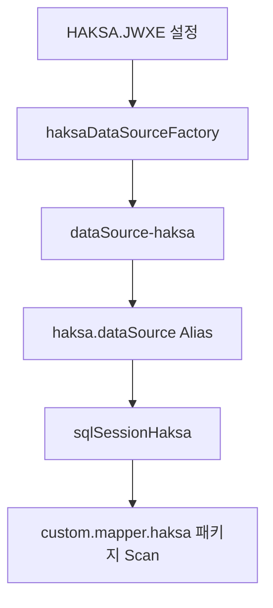

# AppMapper 상속 및 멀티 데이터소스 통합 레퍼런스

> [!NOTE]
> 이 문서는 `AppMapper` 확장 패턴, `HAKSA.JWXE` 멀티 데이터소스 설정 및 MyBatis 연동 가이드에 대해 작성되었습니다. (2026-01-10: 명시적 SqlSessionFactory 주입 가이드 추가)

## 1. AppMapper 기반 Custom Mapper 확장 패턴
### 1.1. 핵심 요약 및 노하우
`AppMapper`는 `EgovAbstractMapper`를 상속받아 프로젝트 공통의 데이터 접근 메서드(`selectList`, `selectOne`, `selectMap` 등)를 제공합니다. 이를 상속받는 새로운 Mapper는 별도의 기본 메서드 구현 없이도 표준화된 데이터 접근 로직을 사용할 수 있습니다.

### 1.2. 주요 명세/가이드
- **상속**: `public class [Custom]AppMapper extends AppMapper`
- **어노테이션**: `@Repository`를 사용하여 Spring Bean으로 등록하며, 중복 노드를 방지하기 위해 고유한 빈 이름을 지정합니다.
- **MyBatis 연동**: `AppMapper` 내부에서 `getSqlSession()`을 활용하므로, 하위 클래스에서 별도의 세션 관리가 필요 없습니다.

---

## 2. JiniworksDataSourceFactory 멀티 데이터소스 설정
### 2.1. 핵심 요약 및 노하우
지니웍스 프레임워크는 `JiniworksDataSourceFactory`를 통해 특정 에일리어스(Alias)를 기반으로 `DataSource`를 동적으로 생성합니다.

### 2.2. 참조 코드/예시
`context-jiniworks-datasource.xml`에 다음과 같이 추가 선언이 필요합니다.
```xml
<!-- 학사 전용 DataSource 팩토리 -->
<bean id="haksaDataSourceFactory" class="md.database.datasource.JiniworksDataSourceFactory">
    <property name="alias" value="HAKSA" />
</bean>

<!-- 학사 전용 DataSource 어댑터 -->
<bean id="dataSource-haksa" class="md.database.datasource.DataSource">
    <property name="dataSourceFactory" ref="haksaDataSourceFactory" />
</bean>

<!-- 에일리어스 설정 -->
<alias name="dataSource-haksa" alias="haksa.dataSource" />
```

---

## 3. MyBatis sqlSession 복수 구성 및 매핑 가이드
### 3.1. 핵심 요약 및 노하우
서로 다른 데이터소스(BASIC, HAKSA)를 사용하는 경우, 각각의 전용 `sqlSession` 빈이 필요합니다. 각 세션은 자신이 관리할 `dataSource`를 주입받습니다.

### 3.2. 주요 명세/가이드
- **sqlSession 분리**: `sqlSession` (기본)과 `sqlSessionHaksa` 등으로 분리하여 선언.
- **매퍼 스캔**: `mybatis:scan` 태그의 `factory-ref` 속성을 사용하여 특정 패키지의 매퍼들이 어떤 세션을 사용할지 지정합니다.

---

## 4. DB Alias(@HAKSA.JWXE) 정의 및 바인딩
### 4.1. 핵심 요약 및 노하우
`@HAKSA.JWXE`는 환경 설정 파일(`.JWXE`)과의 연결 고리입니다. `JiniworksDataSourceFactory`의 `alias` 프로퍼티 값이 `HAKSA`인 경우, 해당 팩토리는 `HAKSA.JWXE` 설정 정보를 읽어 커넥션을 생성합니다.

### 4.2. 구성 체계
1. **설정 파일**: `properties/data-source/data-source/HAKSA.JWXE` (DB 접속 정보)
2. **Spring Bean**: `JiniworksDataSourceFactory` (alias="HAKSA")
3. **Data Source**: `md.database.datasource.DataSource` (factory 주입)

---

## 5. Spring XML 설정 기반 빈 의존성 체계
### 5.1. 핵심 요약 및 노하우
데이터소스 구성은 **Factory -> Adapter -> MyBatis Session -> Mapper Scan** 순서의 계층적 의존성을 가집니다.

### 5.2. 참조 다이어그램 (Mermaid)


---

## 6. MyBatis XML 설정 파일 정밀 가이드 (sqlSession 분리)
### 6.1. 참조 코드/예시
`context-jiniworks-mybatis-mapper.xml`에 학사 전용 세션 및 스캔 추가:
```xml
<!-- 학사 전용 SqlSession -->
<bean id="sqlSessionHaksa" class="com.andwise.jw.mybatis.RefreshableSqlSessionFactoryBean">
    <property name="resourcePathResolover" ref="resourcePathResolover" />
    <property name="dataSource" ref="haksa.dataSource" /> <!-- 위에서 정의한 Alias 참조 -->
    <property name="mapperLocations">
        <list>
            <value>/_custom/${customId}/properties/mybatis/haksa/*.xml</value>
        </list>
    </property>
</bean>

<!-- 학사 전용 Mapper 스캔 -->
<mybatis:scan base-package="custom.mapper.haksa" 
              annotation="org.egovframe.rte.psl.dataaccess.mapper.Mapper" 
              factory-ref="sqlSessionHaksa" />
```

---

## 7. 데이터 접근 계층(DAO/Mapper) 설계 표준
### 7.1. 핵심 가이드
1. **패키지 구조**: `custom.mapper.[업무명]` 구조를 유지합니다.
2. **클래스 명명**: `[업무명]AppMapper` (예: `HaksaAppMapper`)
3. **상속 준수**: 반드시 `AppMapper`를 상속하여 프로젝트 표준 유틸리티를 활용합니다.
4. **SqlSession 명시**: 물리적으로 분리된 DB를 사용하는 경우, 해당 패키지를 스캔하는 `mybatis:scan`에서 올바른 `factory-ref`를 지정했는지 반드시 확인합니다.

---

## 8. 명시적 SqlSessionFactory 주입 가이드 (Advanced)
### 8.1. 핵심 요약 및 노하우
멀티 데이터소스 환경에서 특정 Mapper가 기본 세션이 아닌 별도의 `SqlSessionFactory`를 사용해야 할 경우, `setSqlSessionFactory` 메서드를 오버라이드하여 `@Resource`로 특정 빈을 명시적으로 주입할 수 있습니다.

### 8.2. 참조 코드 (HaksaAppMapper.java)
```java
package custom.mapper.haksa;

import javax.annotation.Resource;
import org.apache.ibatis.session.SqlSessionFactory;
import org.springframework.stereotype.Repository;
import com.andwise.jw.app.service.impl.AppMapper;

@Repository("haksaAppMapper")
public class HaksaAppMapper extends AppMapper {
	
	@Override
    @Resource(name = "haksaSqlSession") // 설정 파일에 정의된 세션 빈 이름
    public void setSqlSessionFactory(SqlSessionFactory sqlSession) {
    	super.setSqlSessionFactory(sqlSession);
    }
}
```

### 8.3. 주의사항
- `@Resource(name = "...")`에 들어가는 이름은 `context-jiniworks-mybatis-mapper.xml` 등에 정의된 `SqlSessionFactory` 빈 ID와 일치해야 합니다.
- 이 방식은 `mybatis:scan`을 통한 자동 바인딩이 어려운 상황이나, 명시적인 코드 가독성이 필요한 경우 유용합니다.
